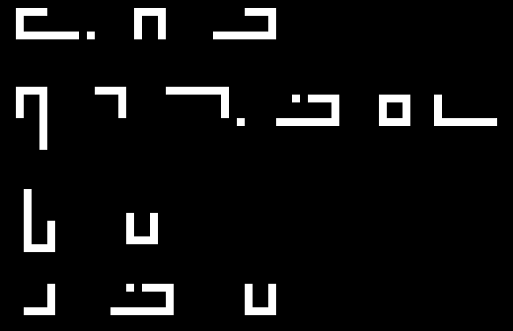

# You Have Not Seen My Colors

| Field | Value |
| --- | --- |
| CTF | z0d1akCTF 2026 Qualifiers |
| Category | Cryptography |
| Author | TitanCode |
| Points | 137 |
| Solves at time of solving | 81 |
| Flag | `zdk{m4S7er_OF_C0l0rs_4nD_C7f}` |

> Elian gave you this challenge. Find meaning in the noise, then prove what
> you decoded to the private endpoint.
>
> The answer is lowercase with words joined by underscores.

## Executive Summary

The handout is a 100 x 100 RGB PNG that appears to be uniformly colored noise.
It contains almost no repeated colors: 9,996 distinct RGB triples across 10,000
pixels. The important anomaly appears only after examining each color channel
separately. Red and green contain every value from 1 through 255 but no zeroes;
blue contains **166 zero-valued pixels**. Selecting exactly those pixels with

```text
mask(x, y) = 1 if B(x, y) == 0 else 0
```

removes the noise and reveals four lines written in **Elian script**. The word
"Elian" in the prompt is the direct pointer to that alphabet.



The script transliterates to:

```text
ZEK
MASTER
OF
CTF
```

The spatially separate `ZEK` line is a signature/attribution, not part of the
answer. Submitting all four lines as `zek_master_of_ctf` produces `403
incorrect`; submitting the lower three lines as `master_of_ctf` succeeds. The
private endpoint returns:

```text
zdk{m4S7er_OF_C0l0rs_4nD_C7f}
```

The supplied [`solve.py`](solve.py) reproduces the entire technical path using
only Python's standard library: it parses and unfilters the PNG, isolates the
blue-zero carrier, writes the enlarged mask, and optionally submits the decoded
answer to a live instance.

## Repository Contents

| Path | Purpose | SHA-256 |
| --- | --- | --- |
| [`challenge/crypto_you-have-not-seen-my-colors.tar.gz`](challenge/crypto_you-have-not-seen-my-colors.tar.gz) | Original challenge handout | `4c5ffce82fa63c1022ebdd97c022830e960d1d9300dc899add889f148ea379eb` |
| [`challenge/image.png`](challenge/image.png) | Noisy RGB image extracted from the handout | `e8def5bad7483aa857eecfca06c30cb48e6c1cfa67758ee64038c5d885d9f7cf` |
| [`solve.py`](solve.py) | Dependency-free extractor and endpoint client | `a2fce548ca038fd16f86533312866d612f7a5eedf3f7c849abe3f6a80c6266a8` |
| [`artifacts/decoded-mask.png`](artifacts/decoded-mask.png) | Cropped 10x rendering of pixels satisfying `B == 0` | `db17c06c61271f2b5fff8fc7d583e26b2d8381b460532ae560a2921f6b40ba34` |
| [`artifacts/pixel-analysis.txt`](artifacts/pixel-analysis.txt) | Exact image and per-channel statistics | `4adc92772ecece826103c1042cf415af388d3072e83f0dc8b59fdea49718746e` |
| [`artifacts/remote-run.txt`](artifacts/remote-run.txt) | Successful private-endpoint transcript | `63b0406a4631f5619508a7efc8513c64c41389c787fc54d0a426d8b4811a27a8` |

The service is an instancer. Its `unseen-colors-<id>.chals.z0d1ak.org`
hostname is short-lived, so the committed transcript preserves the successful
response while `solve.py` accepts any fresh instance URL.

## 1. Inspecting the Handout

The archive contains one small file:

```console
$ tar -tzvf crypto_you-have-not-seen-my-colors.tar.gz
-rwxrwxrwx ... 30168 ... crypto_you-have-not-seen-my-colors/image.png

$ file image.png
image.png: PNG image data, 100 x 100, 8-bit/color RGB, non-interlaced
```

The image is effectively full-frame visual noise. Standard first checks do not
produce a payload:

- there is no useful metadata;
- the PNG ends normally at `IEND`, with no appended archive or text;
- ordinary `strings` output is only PNG/compressed-data debris;
- individual bit planes look random rather than forming readable glyphs.

The title and prompt, however, emphasize **colors** and **noise**. That suggests
treating RGB values as structured data instead of viewing the rendered image.

## 2. Measuring the Color Channels

The exact statistics are unusually revealing:

| Channel | Minimum | Maximum | Distinct values | Pixels equal to zero |
| --- | ---: | ---: | ---: | ---: |
| Red | 1 | 255 | 255 | 0 |
| Green | 1 | 255 | 255 | 0 |
| Blue | 0 | 255 | 256 | 166 |

There are two strong signals here.

First, red and green use every byte value **except zero**. This is not what one
expects from unconstrained random bytes: across 10,000 pixels, a uniformly
random channel would contain about `10000 / 256 = 39.1` zeroes. Their complete
absence indicates that the background noise was deliberately sampled from
`[1, 255]`.

Second, blue follows the same apparent background range but has 166 zeroes.
Those zeroes are therefore not low-probability visual noise; they are a reserved
sentinel value written into one channel. The other two random channel values
keep those pixels colorful on screen, which hides the sentinel pattern from a
normal RGB rendering.

This is also why an exact equality test is better than an arbitrary threshold.
Selecting `B < 16`, for example, includes hundreds of legitimate dark-blue
background values. Selecting **only** `B == 0` gives a sparse, clean carrier.

## 3. Extracting the Hidden Carrier

Conceptually, the extraction is one line:

```python
marked = blue == 0
```

The 166 marked pixels occupy only the upper portion of the canvas, in the
right/bottom-exclusive bounding box `(23, 1, 84, 40)`. Rendering marked pixels
as white and all others as black immediately produces straight-line glyphs.

For reproducibility, the solver does not depend on Pillow or another image
package. It implements the small subset of PNG required by the handout:

1. Validate the eight-byte PNG signature.
2. Parse `IHDR`, concatenate `IDAT`, and stop at `IEND`.
3. Verify every chunk CRC.
4. Decompress the IDAT stream with `zlib`.
5. Reverse PNG filters 0 through 4 (`None`, `Sub`, `Up`, `Average`, `Paeth`).
6. Reconstruct the RGB bytes and select each pixel whose blue byte is zero.
7. Crop to the carrier bounding box and write a 10x nearest-neighbor grayscale
   PNG for inspection.

The extraction result is deterministic:

```console
$ python3 solve.py
[+] zero-valued blue pixels: 166
[+] carrier bounding box: (23, 1, 84, 40)
[+] wrote carrier image: artifacts/decoded-mask.png
[+] Elian transcription:
    ZEK
    MASTER
    OF
    CTF
[+] ZEK is the signature; decoded answer: master_of_ctf
```

The generated mask's SHA-256 is
`db17c06c61271f2b5fff8fc7d583e26b2d8381b460532ae560a2921f6b40ba34`,
which provides a byte-for-byte check of the extraction.

## 4. Recognizing and Reading Elian Script

The prompt begins with **"Elian gave you this challenge"**. Once the angular
carrier is visible, that wording is no longer just a character name: it points
to the Elian writing system.

Elian script derives its glyphs from positions in a grid. A glyph's corner,
bracket, box, or open-box shape identifies a family; changed stroke length and
dots distinguish later alphabet cycles. The extracted carrier contains exactly
these features: right-angle strokes, unequal arms, closed squares, and isolated
dots.

Reading left to right gives:

| Pixel region | Elian letters | Interpretation |
| --- | --- | --- |
| `x=23..55, y=1..4` | `Z E K` | Separate signature/heading |
| `x=23..83, y=11..18` | `M A S T E R` | First answer word |
| `x=24..40, y=24..31` | `O F` | Second answer word |
| `x=24..55, y=36..39` | `C T F` | Third answer word |

Several repeated shapes provide internal checks. The square `E` appears in both
`ZEK` and `MASTER`; the open-bottom `F` repeats in `OF` and `CTF`; and the
dotted bracket used for `T` is repeated in `MASTER` and `CTF`. The repetitions
match exactly at pixel level, removing ambiguity from the transliteration.

The visual plaintext is therefore:

```text
ZEK

MASTER OF CTF
```

## 5. Separating the Signature from the Answer

The final subtlety is semantic rather than cryptographic. If every visible line
is normalized according to the prompt, the candidate is:

```text
zek_master_of_ctf
```

The endpoint rejects it:

```http
POST /solve
Content-Type: application/x-www-form-urlencoded

answer=zek_master_of_ctf

HTTP/2 403
incorrect
```

The layout explains why. `ZEK` is centered on its own top line and separated
from the three-line statement beneath it. It functions as the writer's name or
signature. The phrase to prove is only:

```text
MASTER OF CTF
```

Applying the requested lowercase-and-underscore normalization gives:

```text
master_of_ctf
```

That answer is accepted:

```http
POST /solve
Content-Type: application/x-www-form-urlencoded

answer=master_of_ctf

HTTP/2 200
{"flag":"zdk{m4S7er_OF_C0l0rs_4nD_C7f}"}
```

The HTTP status transition from `403` to `200` confirms both the Elian
transcription and the signature interpretation.

## 6. End-to-End Reproduction

Offline extraction requires only Python 3:

```console
$ cd Crypto/you-have-not-seen-my-colors
$ python3 solve.py
```

Against a fresh private instance:

```console
$ python3 solve.py \
    --endpoint https://unseen-colors-<id>.chals.z0d1ak.org
...
[+] endpoint response: {"flag":"zdk{m4S7er_OF_C0l0rs_4nD_C7f}"}
[+] flag: zdk{m4S7er_OF_C0l0rs_4nD_C7f}
```

The input and mask paths can also be overridden:

```console
$ python3 solve.py path/to/image.png --mask path/to/carrier.png
```

## Flag

```text
zdk{m4S7er_OF_C0l0rs_4nD_C7f}
```

## Lessons

- **Measure before guessing.** A random-looking image becomes structured as soon
  as each channel's minimum and zero count are compared.
- **Exact sentinel values beat broad thresholds.** The carrier is encoded by
  the reserved value `B == 0`; LSB extraction and visual enhancement add noise
  instead of removing it.
- **Use every word of the prompt.** "Colors" points to channel analysis, "noise"
  describes the cover, and "Elian" names the alphabet.
- **Layout carries semantics.** Correctly transliterating all glyphs was not
  enough: the isolated top line was a signature, while the lower three lines
  formed the server's answer.
- **Preserve ephemeral evidence.** Private instances expire. The original
  handout, deterministic mask, checksums, and successful response make the solve
  independently auditable after the host disappears.
