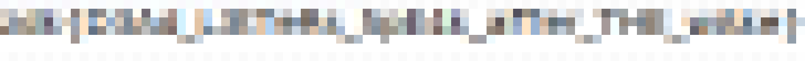
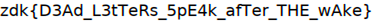

# Dead Letter Wake

| Field | Value |
| --- | --- |
| CTF | z0d1akCTF 2026 Qualifiers |
| Category | Forensics |
| Author | ant1v3n0m |
| Points | 149 |
| Solves at time of solving | 62 |
| Flag | `zdk{D3Ad_L3tTeRs_5pE4k_afTer_THE_wAke}` |

> auth-...wake?

## Executive Summary

Dead Letter Wake combines network forensics, mail-queue recovery, MIME
reassembly, PDF object extraction, and a small renderer-inversion problem. The
packet capture contains six of seven RFC `message/partial` deliveries. The
missing fourth delivery crossed an encrypted SMTP session, so its content is not
available on the wire. Postfix retained that same message as deferred queue item
`DLW214704`, allowing the series to be completed without attacking TLS.

All seven partials share this identity:

```text
<wake.2147.deadletter@relay.pelagos.invalid>
```

Joining their **raw bodies** in numeric order reconstructs a multipart MIME
message containing `recovery-authorization.pdf`. The PDF says its authorization
text was processed with a `PIX-8` mosaic and embeds two raster objects: a 728x56
target and a 1864x256 same-renderer calibration capture.

The calibration is an order-2 de Bruijn sequence over a 24-character alphabet.
It exposes every adjacent character pair and therefore the renderer's glyphs,
advances, and kerning. Its RGB planes also reveal one-pixel phase shifts. The
matching model is DejaVu Sans at 32 px, drawn at `(0, 2)` with Pillow/FreeType,
then transformed as:

```text
R(x) = G(x - 1)
G(x) = rendered grayscale at x
B(x) = G(x + 1)
```

Each target pixel is the gamma-encoded arithmetic mean of one 8x8 source block.
A beam search over the calibration alphabet renders candidate prefixes and
scores their stable block averages. The final candidate has a text-region MSE
of only `0.225977`; after integer rounding, every compared RGB block channel is
within one level of the supplied target.

```text
zdk{D3Ad_L3tTeRs_5pE4k_afTer_THE_wAke}
```

The leetspeak plaintext is "Dead letters speak after the wake."

## Repository Contents

| Path | Purpose | SHA-256 |
| --- | --- | --- |
| [`challenge/forensics_dead-letter-wake.zip`](challenge/forensics_dead-letter-wake.zip) | Untouched original handout | `7168c1c9bf11c66520e749ea3fd7d6011225e9dc959a20c37e9a668040951984` |
| [`solve.py`](solve.py) | End-to-end evidence reconstruction and PIX-8 decoder | See Git history |
| [`Dockerfile`](Dockerfile) | Reproducible TShark, Poppler, font, Pillow, and NumPy environment | See Git history |
| [`artifacts/mail-fragments.csv`](artifacts/mail-fragments.csv) | Fragment provenance, lengths, and body hashes | `55142d835640e27ad777b0c9cfeb7202b792d7b5d8c66cf02a980334f225fa06` |
| [`artifacts/reconstructed.eml`](artifacts/reconstructed.eml) | Reassembled inner MIME message | `92376c22a54e4c5eb0877c7be228e5b5112ef2f5c1c0d675a762b2af8e89f45d` |
| [`artifacts/recovery-authorization.pdf`](artifacts/recovery-authorization.pdf) | PDF attachment recovered from the MIME entity | `2d95160df24564d731fed4e349d108624817b53a8859281d0f542a2bed6a16b4` |
| [`artifacts/pdf-text.txt`](artifacts/pdf-text.txt) | Poppler text extraction of the memorandum | `8c6448fcf298ac7c2d3d82a816315218d4611b06b010b47ac5605856c6077419` |
| [`artifacts/target.png`](artifacts/target.png) | Losslessly extracted PIX-8 authorization target | `2e42c92efca1e2dc0d505672b09f07e1efcf606a60574f4bcd1f37a8fd403334` |
| [`artifacts/calibration.png`](artifacts/calibration.png) | Losslessly extracted renderer calibration | `c89aaec94a7a246c106710c7b0018fa2dcefd4a36e3b97a28e5345d008fc0fa9` |
| [`artifacts/target-enlarged.png`](artifacts/target-enlarged.png) | Nearest-neighbor enlargement of the supplied mosaic | `48ea8f0af715a5237efc3c0caaa3785585511cffbcee81b82ca97413ed66133f` |
| [`artifacts/decoded-render.png`](artifacts/decoded-render.png) | Recovered text rendered through the calibrated RGB model | `f06faeb0d354a30a5c1e9d7026b9ab884e78eb691836be10480f142392335d9e` |
| [`artifacts/decoded-mosaic.png`](artifacts/decoded-mosaic.png) | Recovered rendering after PIX-8 averaging | `b138f13c42441ed3de01d9342066313077447c65fa2431e39756163f04d18c50` |
| [`artifacts/solver-output.txt`](artifacts/solver-output.txt) | Recorded successful end-to-end run | `1200301e5dd6fef45c15bc3b868df7abb13503b1e73f29781f0c099262ea525e` |
| [`artifacts/evidence-hashes.txt`](artifacts/evidence-hashes.txt) | Digest inventory for supplied and derived evidence | See file |

## 1. Preserve and Inventory the Handout

The outer ZIP is deliberately small:

```console
$ unzip -l forensics_dead-letter-wake.zip
  Length      Name
---------  ----------
      185  dead-letter-wake/SHA256SUMS.txt
   241782  dead-letter-wake/evidence/dead-letter.pcap
    13106  dead-letter-wake/evidence/mail-queue.tar.gz
```

The handout itself hashes to:

```text
7168c1c9bf11c66520e749ea3fd7d6011225e9dc959a20c37e9a668040951984
```

Before inspecting either evidence source, verify the supplied manifest:

```console
$ sha256sum -c SHA256SUMS.txt
evidence/dead-letter.pcap: OK
evidence/mail-queue.tar.gz: OK
```

The verified hashes are:

| Evidence | SHA-256 |
| --- | --- |
| `evidence/dead-letter.pcap` | `97a7f265581ac1c0bd1fe1bd05b9df25d450e2a2bf3f0d841fd28b67b63fd36a` |
| `evidence/mail-queue.tar.gz` | `17f95915331c7ef0dd23b8afe7dd7f9cf0bdcb9a31ed8609ec08fee88d9e7cd0` |

The queue archive contains two deferred messages and one mail log:

```text
deferred/BULK771901.eml
deferred/DLW214704.eml
mail.log
```

`BULK771901.eml` is an unrelated cable-catalogue message. `DLW214704.eml`
is a numbered partial and is immediately more interesting.

## 2. Correlate the Encrypted Delivery with the Queue

The final TCP conversation in the capture is between
`10.44.0.77:41404` and `10.44.0.25:25`. Its payload is TLS, so packet
inspection cannot recover the message body. The queue journal supplies the
necessary correlation:

```text
Aug 17 02:31:34 mx postfix/smtpd[6214]: connect from
    spooler.pelagos.invalid[10.44.0.77]:41404
Aug 17 02:31:34 mx postfix/smtpd[6214]: Anonymous TLS connection established
    from spooler.pelagos.invalid[10.44.0.77]: TLSv1.3
Aug 17 02:31:35 mx postfix/cleanup[6220]: DLW214704:
    message-id=<2147-recovery.part4@relay.pelagos.invalid>
Aug 17 02:32:05 mx postfix/smtp[6227]: DLW214704:
    status=deferred (connect to archive.blacktide.invalid timed out)
```

The deferred file's outer MIME headers identify it as part 4 of 7:

```text
Subject: Wake relay 2147-recovery (4/7)
Content-Type: message/partial;
 id="<wake.2147.deadletter@relay.pelagos.invalid>";
 number=4; total=7
```

This is the intended meaning of the description. The inaccessible wire content
is a dead letter in the mail queue, and its identity survives beyond the TLS
boundary.

## 3. Recover the Six Plaintext SMTP Partials

The PCAP contains several decoy mail series, so merely carving base64-looking
data is unsafe. Reassemble client-to-server TCP payloads and parse their SMTP
`DATA` messages. TShark provides stream IDs, TCP sequence numbers, source
addresses, and raw payload bytes:

```console
$ tshark -r dead-letter.pcap \
    -Y 'tcp.dstport == 25 && tcp.payload && !tcp.analysis.retransmission' \
    -T fields -E separator=/t \
    -e tcp.stream -e tcp.seq -e ip.src -e tcp.payload
```

The solver sorts each stream by TCP sequence number, removes overlaps, rejects
gaps, locates the SMTP `DATA` boundary, removes dot stuffing, and parses the
outer headers. It retains only messages with the MIME identity learned from
`DLW214704.eml`.

The resulting inventory is:

| Part | Evidence source | Stream | Raw body bytes |
| ---: | --- | --- | ---: |
| 1 | PCAP, `10.44.0.77` | 1 | 15,388 |
| 2 | PCAP, `10.44.0.77` | 6 | 16,378 |
| 3 | PCAP, `10.44.0.77` | 3 | 16,378 |
| 4 | Queue item `DLW214704` | TLS | 16,380 |
| 5 | PCAP, `10.44.0.77` | 8 | 16,378 |
| 6 | PCAP, `10.44.0.77` | 11 | 16,300 |
| 7 | PCAP, `10.44.0.77` | 12 | 16,141 |

The precise body hashes are recorded in
[`mail-fragments.csv`](artifacts/mail-fragments.csv). Parts do not appear in
numeric stream order, which is another reason to trust MIME metadata rather
than capture order.

## 4. Reassemble the Original MIME Entity

RFC `message/partial` is unusual: each wrapper body is a raw byte range from a
larger message. The wrappers themselves are not concatenated. After separating
each outer header block at `CRLF CRLF`, restore the original as:

```python
reconstructed = b"".join(
    fragment.body for fragment in sorted(fragments, key=lambda part: part.number)
)
```

No newline or MIME boundary may be inserted between fragments. Adding one would
change the base64 attachment and invalidate the reconstruction. The result is
113,343 bytes with SHA-256:

```text
92376c22a54e4c5eb0877c7be228e5b5112ef2f5c1c0d675a762b2af8e89f45d
```

Parsing [`reconstructed.eml`](artifacts/reconstructed.eml) as a fresh MIME
message yields:

| MIME type | Filename | Decoded bytes |
| --- | --- | ---: |
| `text/plain` | none | 36 |
| `application/pdf` | `recovery-authorization.pdf` | 82,328 |

The text part says `Automated ledger transfer follows.` The PDF attachment
hashes to:

```text
2d95160df24564d731fed4e349d108624817b53a8859281d0f542a2bed6a16b4
```

## 5. Follow the PDF's Recovery Instructions

The two-page memorandum explicitly describes the evidence path:

```text
Group partial messages by their MIME identity and number.
Join the seven raw partial bodies in sequence and parse the result as a new
MIME message.
Extract the document's raster objects losslessly.
The PIX-8 target and its same-renderer calibration capture use gamma-encoded
RGB averages and must be handled as original-resolution images.
```

The word **losslessly** matters. A screenshot, PDF render, resize, or JPEG
conversion changes the per-block values used later. `pdfimages` extracts the
embedded streams directly:

```console
$ pdfimages -list recovery-authorization.pdf
page num type  width height color comp bpc
   2   0 image   728     56 rgb      3   8
   2   1 image  1864    256 rgb      3   8

$ pdfimages -png recovery-authorization.pdf image
```

The two original rasters are preserved as [`target.png`](artifacts/target.png)
and [`calibration.png`](artifacts/calibration.png).

## 6. Understand the PIX-8 Target

The 728x56 target has constant color within every aligned 8x8 region. It is
therefore a grid of:

```text
728 / 8 = 91 columns
 56 / 8 =  7 rows
```

The enlarged image makes the mosaic explicit:



Block rows 0 and 6 are pale acquisition bands, row 5 is blank, and rows 1
through 4 contain the authorization. The solver scores only those four text
rows so the acquisition metadata cannot bias candidate selection.

The PDF says the values are gamma-encoded RGB averages. This means each color
channel is averaged directly in its stored 8-bit sRGB representation. It would
be incorrect to linearize sRGB before averaging:

```text
M[i,j,c] = (1 / 64) * sum(P[8i+u, 8j+v, c])
                         for u,v in [0,7])
```

## 7. Reverse the Calibration Capture

The calibration text is not random. Reading its first symbols gives:

```text
334353A3D3E3H3L3R3T3_3a3d3e3f3k3p3r3s3t3w3z3{3}4454A4D4E4...
```

Its alphabet is:

```text
345ADEHLRT_adefkprstwz{}
```

There are 24 symbols. An order-2 de Bruijn cycle contains each possible pair
exactly once and has length `24^2 = 576`. The capture contains those 576 symbols
plus the first symbol repeated to close the cycle, for 577 total characters.
It is wrapped every 90 characters into seven lines.

This construction is ideal renderer calibration. Every glyph is present and
every kerning pair is exercised. Matching the capture establishes:

| Property | Recovered value |
| --- | --- |
| Font | DejaVu Sans 2.37 |
| Font file SHA-256 | `57f73e11f51999432bf7ab22ce55b6f945d5eca1bf824404cfa9ec2e3718c84e` |
| Font size | 32 px |
| Origin | `(0, 2)` |
| Calibration line spacing | 4 px |
| Renderer | Pillow/FreeType |

The calibration's color planes are shifted samples of the same grayscale
rendering:

```python
rgb[:, :, 1] = gray
rgb[:, 1:, 0] = gray[:, :-1]
rgb[:, :-1, 2] = gray[:, 1:]
```

In coordinate form, `R(x)=G(x-1)` and `B(x)=G(x+1)`, with white introduced at
the image edges. This explains the red and blue fringes around dark glyphs.

Regenerating the entire 1864x256 calibration with this model gives MSE
`0.945549` over raw 8-bit RGB values. That sub-unit error confirms the renderer;
the small residual is inconsequential antialiasing/rounding variation.

## 8. Decode the Mosaiced Authorization

Direct OCR is unreliable because each glyph has been reduced to a few colored
blocks and capitalization is significant. Instead, use the calibrated renderer
as a forward model:

1. Begin with the known flag prefix `zdk{`.
2. Append each symbol from the calibration alphabet except braces.
3. Render the candidate at `(0, 2)` with 32 px DejaVu Sans.
4. Construct its shifted RGB channels.
5. Average each aligned 8x8 block in gamma-encoded channel space.
6. Compute MSE against target block rows 1 through 4.
7. Keep the 16 lowest-error prefixes and repeat.
8. Once a prefix reaches 82% of the target width, test a closing brace against
   the entire text region.

When scoring an incomplete prefix, the solver leaves the final 8-pixel column
unscored. A future glyph can overhang its origin and affect that block; scoring
it too early would incorrectly penalize the true prefix. This is why the single
best displayed beam candidate occasionally ends in a temporary `f`, while the
correct state remains among the 16 retained candidates.

The last stable stages are:

```text
depth=33  zdk{D3Ad_L3tTeRs_5pE4k_afTer_THE_
depth=34  zdk{D3Ad_L3tTeRs_5pE4k_afTer_THE_w
depth=35  zdk{D3Ad_L3tTeRs_5pE4k_afTer_THE_wA
depth=36  zdk{D3Ad_L3tTeRs_5pE4k_afTer_THE_wAk
depth=37  zdk{D3Ad_L3tTeRs_5pE4k_afTer_THE_wAke
```

Appending `}` produces full text-region MSE `0.225977`. After rounding each
modeled average to an integer, 100% of the compared RGB values differ from the
target by at most one. The reconstructed source rendering is:



The result is therefore unambiguous:

```text
zdk{D3Ad_L3tTeRs_5pE4k_afTer_THE_wAke}
```

## 9. Reproduce the Solve

The Docker path pins Python, Pillow, NumPy, TShark, Poppler, and the exact
DejaVu font package used during the solve:

```console
$ cd Forensics/dead-letter-wake
$ docker build -t dead-letter-wake-solver .
$ mkdir -p /tmp/dead-letter-wake-output
$ docker run --rm \
    -v "$PWD:/work:ro" \
    -v /tmp/dead-letter-wake-output:/output \
    dead-letter-wake-solver \
    /work/challenge/forensics_dead-letter-wake.zip \
    --output /output
```

The final lines should be:

```text
[+] Full-image PIX-8 MSE: 0.225977
[+] FLAG: zdk{D3Ad_L3tTeRs_5pE4k_afTer_THE_wAke}
```

For a native run, install TShark, Poppler (`pdfimages` and optionally
`pdftotext`), and DejaVu Sans 2.37, then install the Python requirements:

```console
$ python3 -m venv .venv
$ . .venv/bin/activate
$ pip install -r requirements.txt
$ python solve.py challenge/forensics_dead-letter-wake.zip \
    --output /tmp/dead-letter-wake-output
```

The solver validates both supplied evidence hashes, checks the calibrated font
hash, rejects incomplete or duplicate fragment sets, and stops only when a
complete candidate achieves a sub-1.0 full target MSE.
