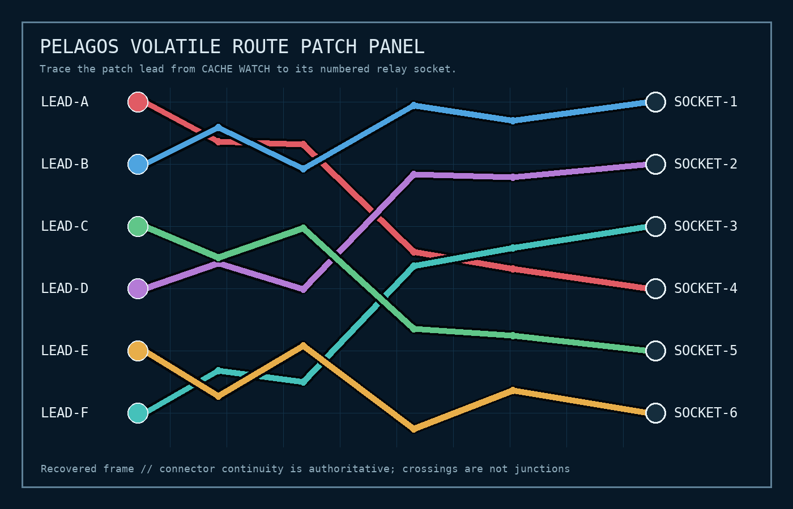

# Unrotated

| Field | Value |
| --- | --- |
| CTF | z0d1akCTF 2026 Qualifiers |
| Category | Forensics |
| Author | ant1v3n0m |
| Points | 137 |
| Solves at time of solving | 81 |
| Flag | `zdk{a_HuM4n_REaD5_7HE_W4ke_nO7_7h3_14Bel5}` |

> i dont know what happened to the oceanographic beacon but it was transmitting
> fine and then it just stopped. the last transmission was a bit garbled, but i
> think it might have been trying to tell us something. BUT I DUNNO

## Executive Summary

Unrotated is a seven-part incident-response investigation spread across identity,
application, governance, host, container, network, and physical-routing evidence.
The incident begins with an emergency credential that was scheduled for rotation
but left active because its owner claimed the connector was retired. An attacker
used that credential, created a local administrator under an unrelated legitimate
change record, and later used the persistent identity to delegate a runner job.

The host and network evidence then establish the execution chain. `OR-7312`
started a worker on `collab-app-01`; the resulting process contacted a legitimate
forecast partner, opened an unapproved rendezvous at `203.0.113.86:8448`, and
attempted SSH access to a non-production console. Recovering the runner's route
requires three different representations of the same path:

1. An OCI cache's deleted lower-layer `route.json` identifies the screen record.
2. Replaying a deliberately scrambled asciinema cast maps that record to
   `LEAD-E`.
3. Tracing `LEAD-E` through the patch-panel image reaches `SOCKET-6`, which the
   socket legend names `BLUEFIN`.

The complete report accepted by the challenge service was:

```text
depth-chart-archive
2026-06-11T09:26:41Z
mara.venn
CHG-2147
OR-7312
BLUEFIN@203.0.113.86:8448
console-cpt-03
```

The service returned:

```text
zdk{a_HuM4n_REaD5_7HE_W4ke_nO7_7h3_14Bel5}
```

## Repository Contents

| Path | Purpose |
| --- | --- |
| [`challenge/forensics_unrotated.zip`](challenge/forensics_unrotated.zip) | Untouched original handout, including the nested evidence archive |
| [`solve.py`](solve.py) | End-to-end reconstruction and optional TLS submission client |
| [`artifacts/evidence-hashes.txt`](artifacts/evidence-hashes.txt) | SHA-256 hashes for the handout, nested archive, and every evidence file |
| [`artifacts/incident-timeline.csv`](artifacts/incident-timeline.csv) | Normalized high-signal incident timeline |
| [`artifacts/journal-relevant.txt`](artifacts/journal-relevant.txt) | Decoded journal entries for the compromised runner execution |
| [`artifacts/oci-routes.csv`](artifacts/oci-routes.csv) | Route metadata carved from the OCI images' historical layers |
| [`artifacts/watch-console.txt`](artifacts/watch-console.txt) | Final screen recovered by replaying the ANSI cursor updates |
| [`artifacts/route-patch-panel.png`](artifacts/route-patch-panel.png) | Patch-panel frame used to trace `LEAD-E` to `SOCKET-6` |
| [`artifacts/route-chain.txt`](artifacts/route-chain.txt) | Compact runner-to-operation attribution chain |
| [`artifacts/incident-report.txt`](artifacts/incident-report.txt) | The seven report values in submission order |
| [`artifacts/accepted-service-response.txt`](artifacts/accepted-service-response.txt) | Recorded successful verdict and flag |

## 1. Preserve and Validate the Evidence

The outer handout contains one nested ZIP:

```console
$ unzip -l forensics_unrotated.zip
  Length      Name
---------     ----
   148059     unrotated-evidence.zip
```

The inner archive expands to about 8.9 MB and contains 16 evidence files. Most
of the size is an 8 MiB systemd journal; the rest consists of CSV logs, a SQLite
directory, an OCI image layout, an asciinema cast, and a PNG patch-panel frame.

The outer archive's SHA-256 is:

```text
2c2ce25b1b54ceddff01b6755ddd9711dfa6b3473d10fd465b1d038dc4fdd221
```

Before analysis, verify `SHA256SUMS.txt` from the inner archive:

```console
$ (cd unrotated-evidence && sha256sum -c SHA256SUMS.txt)
collaboration/audit.csv: OK
collaboration/directory.db: OK
gateway/access.log: OK
...
repository/access.csv: OK
```

All 15 listed evidence files verify. The full digest inventory is preserved in
[`artifacts/evidence-hashes.txt`](artifacts/evidence-hashes.txt).

## 2. Find the Credential That Escaped Rotation

`identity/rotation_manifest.csv` records the emergency rotation batch. Most
credentials have a completion timestamp. Three do not:

| Label | Completion | Review note |
| --- | --- | --- |
| `stormwire-pager` | blank | exception approved through vendor cutover |
| `tide-model-vendor` | blank | exception approved for forecast migration |
| `depth-chart-archive` | blank | owner reported connector retired |

An empty timestamp alone is not enough to call a credential malicious. The
first two labels are documented in `identity/partner_registry.csv`, together
with a precise source address, validity interval, and expected user agent. They
are legitimate temporary exceptions.

`depth-chart-archive` has no partner authorization. Its manifest row is:

```text
label          = depth-chart-archive
fingerprint    = af6717eb72a9c4eeb79b
principal_uuid = 78ea4f91-86c4-437b-8738-d6f210f8d8bb
completed_utc  = <empty>
review_note    = owner reported connector retired
```

A supposedly retired connector is not a reason to leave its token usable. It
is the unexplained rotation failure and therefore report field 1:

```text
depth-chart-archive
```

## 3. Establish the First Confirmed Intrusion Session

Pivot from the manifest fingerprint into `gateway/access.log`:

```text
ts=2026-06-11T09:26:41Z
src=198.51.100.73
method=GET
path=/collab/rest/api/2/myself
status=200
token_fp=af6717eb72a9c4eeb79b
subject=78ea4f91-86c4-437b-8738-d6f210f8d8bb
ua=Mozilla/5.0
session=ssn-f1d072498c1cb5c8
```

This is not partner traffic: the source does not match either approved partner
CIDR, and the browser user agent does not match the registered relay agents.
`collaboration/audit.csv` independently records the same request as a successful
`session_start` with the detail `integration token accepted`.

Later requests in the same session search for `remote access` and `integration
owner`, but the first confirmed successful authentication is the `/myself`
request. Report field 2 is therefore:

```text
2026-06-11T09:26:41Z
```

## 4. Recover the Persistence Identity

The stale credential's principal is `svc-depth-archive` in
`collaboration/directory.db`. On 12 June, that service principal performed two
administrative actions:

```text
2026-06-12T14:08:11Z principal_create
  target=principal/aa839c52-32ac-4d89-af86-76e53f6f3898
  detail="account type=human change_ref=CHG-2147"

2026-06-12T14:10:02Z group_member_add
  target=platform-admins/aa839c52-32ac-4d89-af86-76e53f6f3898
  detail="membership granted change_ref=CHG-2147"
```

Resolve the created UUID through the SQLite directory:

```sql
SELECT account_name, kind, enabled, created_utc
FROM principals
WHERE principal_uuid = 'aa839c52-32ac-4d89-af86-76e53f6f3898';
```

```text
mara.venn | human | 0 | 2026-06-12T14:08:11Z
```

The account is disabled in the recovered final state, but its creation and
administrator membership supplied persistence during the incident. Report field
3 is:

```text
mara.venn
```

## 5. Prove That `CHG-2147` Was Stolen as Cover

The attacker attached `change_ref=CHG-2147` to both persistence actions. The
governance ledger shows what this approved record actually authorized:

```text
change_id           CHG-2147
window              2026-06-12T13:30:00Z .. 2026-06-12T14:30:00Z
expected_actor_uuid 5418adbe-06df-4561-bf33-36b98580b16e  (amina.rao)
action              group_member_add
subject_uuid        f5ec1e2e-b76c-4974-859c-4ae8e44ca245  (nora.alves)
status              approved
summary             Promote on-call platform engineer after access review
```

The legitimate sequence is visible at 13:43 and 13:51: `amina.rao` creates and
promotes `nora.alves`. Seventeen minutes later, `svc-depth-archive` repeats the
pattern for `mara.venn` while citing the same change number. The timestamp falls
inside the approved window, but both actor and subject are wrong. This is
misappropriation, not authorization.

Report field 4 is:

```text
CHG-2147
```

## 6. Identify the Delegated Host-Compromise Job

On 18 June, the persistent account submits one runner job:

```text
2026-06-18T03:44:52Z
actor_uuid = aa839c52-32ac-4d89-af86-76e53f6f3898  (mara.venn)
action     = runner_job_submit
target     = opsrunner/jobs/OR-7312
result     = accepted
detail     = execution delegated to collab-app-01 change_ref=CHG-2147
```

The systemd journal is compressed and uses the compact journal format, so a raw
`strings` scan omits important structure. Decode it with `journalctl`:

```console
$ journalctl --file=host/system.journal --no-pager -o short-iso-precise \
    | grep -E 'OR-7312|pid=24144|proc-7ae13f0c35d8'
```

The relevant chain is:

```text
2026-06-18T03:44:52Z opsrunner job=OR-7312 ... component=plugin-cache ...
2026-06-18T03:44:53Z worker child started pid=24144 pool_slot=ae6cb163
2026-06-18T03:46:03Z outbound connection accepted
                     proc_ref=proc-7ae13f0c35d8
                     policy=legacy-general-egress
```

The duplicated `routine audit completed result=clean` message is not an
exonerating result. It is attached to the exact request that launches the worker
and is contradicted by the network evidence seconds later.

Report field 5 is:

```text
OR-7312
```

## 7. Attribute the Process and Rendezvous

Filter `network/firewall.csv` to the ten minutes following the job and correlate
on `proc-7ae13f0c35d8`:

| Time (UTC) | Destination | Result | Rule |
| --- | --- | --- | --- |
| 03:45:41 | `203.0.113.18:443` | allow | `partner-egress` |
| 03:46:03 | `203.0.113.86:8448` | allow | `legacy-general-egress` |
| 03:51:28 | `10.43.18.61:22` | deny | `segmentation-default-deny` |

`network/approved_egress.csv` authorizes `203.0.113.18:443` for Tethys Forecast
Cooperative. It contains no entry for `203.0.113.86` or port 8448. The second
flow is therefore the external rendezvous:

```text
203.0.113.86:8448
```

The Tethys cover flow also identifies the functional route as the forecast
**survey** profile. This matters because the cache labels themselves are not
authoritative; the actual route has to be recovered from historical content and
then traced across the volatile console and patch panel.

### 7.1 Recover Deleted OCI Route Material

`host/runner-cache.oci.tar` is an OCI image layout containing six cache
manifests. Each manifest has two layers. The lower layer contains
`opt/pelagos/cache/routes/route.json`; the upper layer contains:

```text
opt/pelagos/cache/routes/.wh.route.json
```

That `.wh.route.json` file is an OCI whiteout. It hides `route.json` in a merged
container view but does not remove the bytes from the lower layer. Walking the
historical layers recovers all six records; see
[`artifacts/oci-routes.csv`](artifacts/oci-routes.csv). The survey route is:

```json
{
  "channel": "pel-8",
  "console_slot": "starboard-3",
  "profile": "survey",
  "schema": 2,
  "screen_ref": "watch-64a7a9d8bbd9"
}
```

This route came from the historical layer of `cache-f`, not from a surviving
file in the final merged filesystem.

### 7.2 Reconstruct the Garbled Console Cast

`host/watch-console.cast` is an asciinema v2 recording with Unix timestamp
`1781754300`, or `2026-06-18T03:45:00Z`: seven seconds after the worker starts.
The output looks garbled because characters are emitted individually and out of
order using ANSI absolute-cursor commands. It is not a transposition cipher.

Replaying each `ESC[row;columnH` update into a 120 by 24 character buffer
recovers the final screen in
[`artifacts/watch-console.txt`](artifacts/watch-console.txt). The relevant row
is:

```text
watch-64a7a9d8bbd9  starboard-3    pel-8    LEAD-E       cached
```

The OCI route and cast agree on all three machine-readable fields: screen
reference, console slot, and channel. The cast adds the physical identifier
`LEAD-E`.

### 7.3 Trace the Patch Panel

The recovered frame instructs us to trace connector continuity and warns that
crossings are not junctions:



Following the amber `LEAD-E` line through each turn reaches `SOCKET-6`. The CSV
socket legend then supplies the operation name:

```text
SOCKET-6,BLUEFIN
```

Combining that operation with the unapproved firewall destination gives report
field 6:

```text
BLUEFIN@203.0.113.86:8448
```

## 8. Resolve the Follow-On Hostname

The final flow from the same compromised process is a denied SSH attempt to
`10.43.18.61`. `network/host_inventory.csv` resolves it as:

```text
hostname    = console-cpt-03
address     = 10.43.18.61
environment = non-production
owner       = network-lab
```

The shared process reference prevents confusion with recurring backup probes to
other lab consoles. Report field 7 is:

```text
console-cpt-03
```

## 9. Submit the Incident Report

The service accepts seven line-oriented answers over TLS and deliberately
returns no partial verdicts:

```console
$ python3 solve.py challenge/forensics_unrotated.zip \
    --submit unrotated-e94e4c439400.chals.z0d1ak.org:1337
[+] verified 15 evidence checksums
[+] reconstructed incident report
    report[1] = depth-chart-archive
    report[2] = 2026-06-11T09:26:41Z
    report[3] = mara.venn
    report[4] = CHG-2147
    report[5] = OR-7312
    report[6] = BLUEFIN@203.0.113.86:8448
    report[7] = console-cpt-03
Investigation complete.
Flag: zdk{a_HuM4n_REaD5_7HE_W4ke_nO7_7h3_14Bel5}
```

The flag summarizes the intended investigative lesson: follow the observable
trail left by the execution, not a convenient label attached to one isolated
artifact.

## 10. Reproduce the Offline Analysis

The solver uses only the Python standard library for ZIP, CSV, SQLite, OCI tar,
ANSI cast, and network correlation. Decoding `system.journal` additionally
requires either a local `journalctl` or Docker with `archlinux:latest`:

```console
$ cd Forensics/unrotated
$ python3 solve.py challenge/forensics_unrotated.zip --artifacts artifacts
[+] verified 15 evidence checksums
[+] reconstructed incident report
    report[1] = depth-chart-archive
    report[2] = 2026-06-11T09:26:41Z
    report[3] = mara.venn
    report[4] = CHG-2147
    report[5] = OR-7312
    report[6] = BLUEFIN@203.0.113.86:8448
    report[7] = console-cpt-03
[+] wrote analysis artifacts to artifacts
```

If neither journal reader is available, `--allow-missing-journalctl` permits the
remaining evidence chain to run. The audit and firewall logs still derive all
seven report values, but the host-level confirmation will be omitted.

## Incident Timeline

| Timestamp (UTC) | Event |
| --- | --- |
| 2026-06-09 06:00:00 | `depth-chart-archive` scheduled for rotation, never completed |
| 2026-06-11 09:26:41 | First successful stale-token session from `198.51.100.73` |
| 2026-06-12 14:08:11 | `mara.venn` created under misused `CHG-2147` |
| 2026-06-12 14:10:02 | `mara.venn` added to `platform-admins` |
| 2026-06-18 03:44:52 | `mara.venn` submits delegated runner job `OR-7312` |
| 2026-06-18 03:44:53 | Worker PID 24144 starts on `collab-app-01` |
| 2026-06-18 03:45:41 | Compromised process uses legitimate Tethys egress as cover |
| 2026-06-18 03:46:03 | Process reaches unapproved `203.0.113.86:8448` rendezvous |
| 2026-06-18 03:51:28 | Same process attempts SSH to `console-cpt-03` |
| 2026-06-19 15:49:00 | Stale service principal disabled during security review |
| 2026-06-19 16:27:00 | Persistent `mara.venn` identity disabled |

## Findings and Remediation

1. **Rotation exceptions were not closed.** A retired connector's credential
   remained valid after the emergency batch. Retirement must trigger revocation,
   not exemption. Every exception should have an owner, expiry, observed source,
   and automated enforcement.
2. **The application trusted a change-reference string.** `CHG-2147` was reused
   with the wrong actor, action sequence, and subject. Authorization should bind
   all four properties and reject replays after the approved change completes.
3. **A service identity could create human administrators.** The stale
   integration principal had excessive privileges. Separate service and human
   administration planes and require step-up approval for privileged membership.
4. **Legacy general egress allowed command-and-control traffic.** The process
   reached port 8448 outside the approved destination list. Remove the fallback
   rule and enforce destination-aware egress at both workload and network layers.
5. **Cache cleanup did not destroy historical data.** OCI whiteouts changed the
   merged view but retained route bytes in old layers. Sensitive route material
   should never enter a distributable layer; rebuild and garbage-collect the
   source blobs when removal is required.
6. **Cross-layer correlation was essential.** No single log proves the whole
   incident. Credential fingerprint, UUID, request ID, job ID, process reference,
   screen reference, patch lead, and socket number form the complete chain of
   custody.
