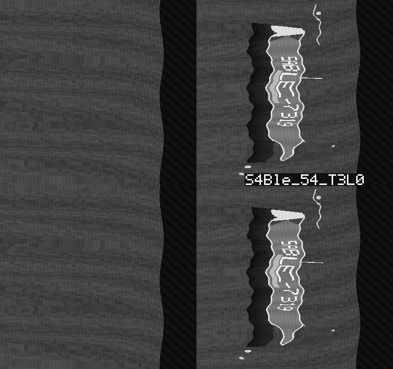
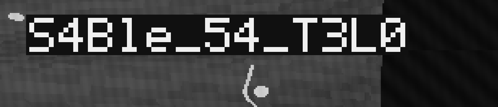
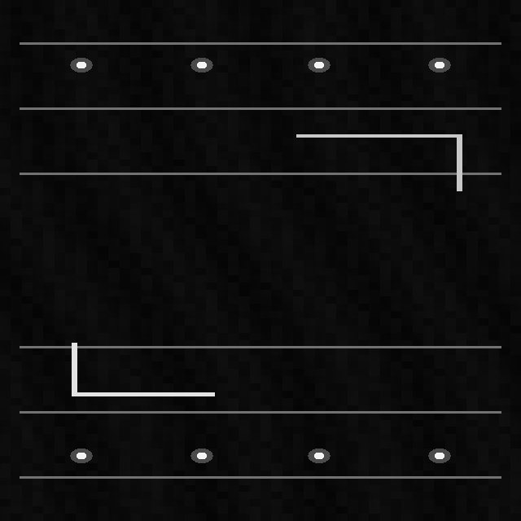
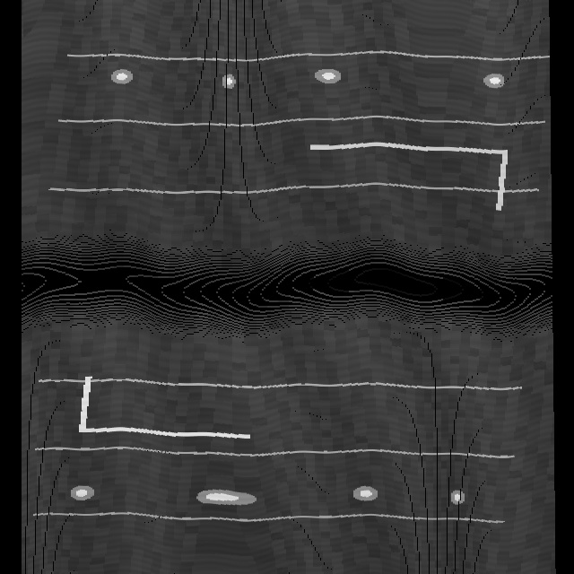
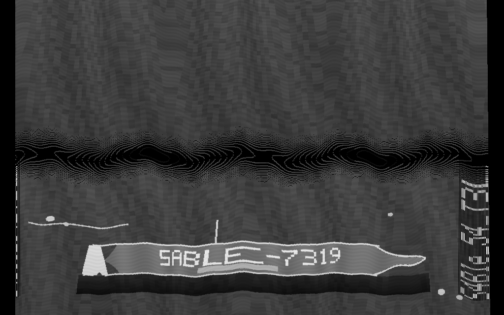
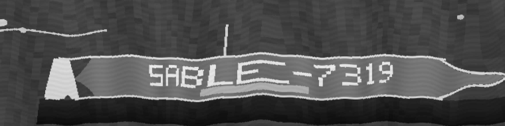

# Black Tide Survey

| Field | Value |
| --- | --- |
| CTF | z0d1akCTF 2026 Qualifiers |
| Category | Reverse Engineering |
| Author | pokymono |
| Points | 179 |
| Solves at time of release | 39 |
| Flag | `zdk{S4Ble_54_T3L0}` |

> Survey unit BT-04 was recovered twelve nautical miles east of its assigned
> transect.
>
> Recover the final surveyed image and identify the marked vessel.

## Executive Summary

The handout contains two recordings in an undocumented `BTS2` side-scan sonar
format, a reference image for the dock recording, and a stripped diagnostic
program. The diagnostic program is intentionally incomplete: it validates and
decodes each recording, but emits raw ping rows without restoring chronological
order or projecting the samples into world coordinates.

Reversing the binary reveals a tagged, CRC-protected container. Every ping has
two banks of 384 samples. Each bank packs two 12-bit words into three bytes and
then applies ZigZag delta coding modulo 4096. The physical records are stored as
all even sequence numbers followed by all odd sequence numbers. Sorting by the
embedded sequence number restores acquisition order.

There are two useful recovery paths:

1. Reproduce the diagnostic image as `reverse(port) || starboard`. A clear 5x7
   marker in this raw frame reads `S4Ble_54_T3L0`.
2. Apply calibration gains, slant-to-ground correction, side-specific range
   ordering, navigation coordinates, and heading. The resulting survey image
   shows the complete vessel and its hull identifier, `SABLE-7319`.

The supplied [solver](solve.py) implements both paths using only Python's
standard library. It validates every header and record CRC before emitting any
artifact.

## Repository Contents

| Path | Purpose | SHA-256 |
| --- | --- | --- |
| [`challenge/rev_black-tide-survey.zip`](challenge/rev_black-tide-survey.zip) | Original challenge handout | `a1179be94dd993bb996ed217cb5a7735e1dbf75daf3725932f1bfbb36a8c16c8` |
| [`artifacts/dock-reference.png`](artifacts/dock-reference.png) | Supplied expected dock layout | `ba216e5244404786271eea9da6e7f53d10ac3a8e756ab74d05f8c36a7c216164` |
| [`artifacts/dock-reconstructed.png`](artifacts/dock-reconstructed.png) | Independently decoded dock survey | `6ab8eba594e91f144c6af20488cd4d40cb3a0b4800c41dcd7f788413cb5a3d8c` |
| [`artifacts/raw-diagnostic.png`](artifacts/raw-diagnostic.png) | Byte-for-byte pixel reproduction of `sonar_diag` output | `4c040719902eed3c865ab3cb2f319f61a1c594968e23102c3353e05adb310792` |
| [`artifacts/final-survey.png`](artifacts/final-survey.png) | Georeferenced final transect | `ee53fc84e765e6444e8658e547235213b12865c9d6bfc204cac764278d2b18fd` |
| [`artifacts/vessel-id.png`](artifacts/vessel-id.png) | Enlarged crop of the surveyed vessel | `55694541016f8404dc8e3e5417be81107acc3a11c9d018ce58d609371871b04f` |
| [`artifacts/flag-marker.png`](artifacts/flag-marker.png) | Nearest-neighbor crop of the exact marker | `0600defd6b4b251918c088b60cef3ad37c3845f532e46ac963affaffd639d4ec` |

## 1. Initial Triage

The archive contains six files:

```console
$ unzip -l rev_black-tide-survey.zip
  Length      Name
---------     ----
      610     RECOVERY_NOTE.txt
      418     SHA256SUMS
   356589     dock_calibration.bts
    28455     dock_reference.png
   855551     final_transect.bts
    18824     sonar_diag
```

The supplied checksums validate successfully. The diagnostic tool is a small,
stripped x86-64 Linux executable:

```console
$ file sonar_diag
sonar_diag: ELF 64-bit LSB pie executable, x86-64, dynamically linked, stripped

$ strings sonar_diag | grep -E 'BTS2|PING|usage|survey'
BTS2
PING
survey contains no pings
768
wrote
 survey rows
usage: sonar_diag INPUT.bts OUTPUT.pgm
```

The fixed width `768` immediately suggests two 384-sample banks. Running the
tool confirms that it creates an 8-bit binary PGM with one row per ping:

```console
$ ./sonar_diag final_transect.bts final.pgm
wrote 720 survey rows

$ file final.pgm
final.pgm: Netpbm image data, size = 768 x 720, rawbits, greymap
```

The recovery note supplies several geometric hints:

```text
Near water is not near ground.
Port comes home; starboard goes away.
```

The first refers to slant range versus ground range. The second describes the
opposite signs used to project the port and starboard banks.

## 2. Reversing the BTS2 Header

Both recordings begin with a 32-byte little-endian header. A hexdump of the
final transect starts as follows:

```text
42 54 53 32 02 00 20 00 5e 90 13 df 80 01 d0 02
e8 03 00 00 40 9c 00 00 07 01 00 00 c2 7f c6 1a
```

Cross-referencing each field with the validation logic in `sonar_diag` gives:

| Offset | Size | Field | Final value |
| ---: | ---: | --- | ---: |
| `0x00` | 4 | Magic | `BTS2` |
| `0x04` | 2 | Version | `2` |
| `0x06` | 2 | Header size | `32` |
| `0x08` | 4 | Recording ID | `0xdf13905e` |
| `0x0c` | 2 | Bins per bank | `384` |
| `0x0e` | 2 | Ping count | `720` |
| `0x10` | 4 | Near range, millimetres | `1000` |
| `0x14` | 4 | Sample rate, hertz | `40000` |
| `0x18` | 4 | Flags | `0x107` |
| `0x1c` | 4 | Header CRC-32 | `0x1ac67fc2` |

The final word is the ordinary IEEE CRC-32 of bytes `0x00..0x1b`. Rejecting a
bad CRC early is valuable because a single damaged size field would otherwise
desynchronize every subsequent record.

The corresponding parser definition is:

```python
HEADER = struct.Struct("<4sHHIHHIIII")
```

## 3. Recovering the Record Layer

Starting at offset `0x20`, the file is a stream of tagged records. Each record
has a 12-byte header:

```c
struct record_header {
    char tag[4];
    uint32_t payload_size;
    uint32_t payload_crc32;
};
```

The observed tags are:

| Tag | Meaning |
| --- | --- |
| `META` | Newline-delimited recording metadata |
| `CALB` | 32 unsigned Q8.8 gain values |
| `PING` | Navigation data plus two packed sonar banks |
| `DONE` | End marker |

The final recording's metadata is:

```text
unit=BT-04
head=SSX-27R
mission=BLACK-TIDE
operator=M.KADE
```

Every payload has its own CRC-32. The solver checks these values before parsing
the payload, making malformed data fail explicitly instead of producing a
plausible but incorrect picture.

## 4. Understanding a PING Record

A `PING` payload is exactly 1,176 bytes:

```text
[ 24-byte ping header ][ 576-byte port bank ][ 576-byte starboard bank ]
```

The 24-byte header is decoded with `<IIiihHI`:

| Offset | Type | Field |
| ---: | --- | --- |
| `0x00` | `uint32` | Sequence number |
| `0x04` | `uint32` | Hull timestamp in milliseconds |
| `0x08` | `int32` | X position in millimetres |
| `0x0c` | `int32` | Y position in millimetres |
| `0x10` | `int16` | Heading in 0.001-degree units |
| `0x12` | `uint16` | Sonar altitude in millimetres |
| `0x14` | `uint32` | Ping flags |

The arithmetic also explains the bank size. There are 384 12-bit samples:

```text
384 samples * 12 bits / 8 = 576 bytes
```

## 5. Unpacking and Delta Decoding

The function at virtual address `0x2060` consumes three input bytes at a time
and creates two 12-bit words:

```python
w0 = b0 | ((b1 & 0x0f) << 8)
w1 = (b1 >> 4) | (b2 << 4)
```

Only the first word is an absolute sample. Every remaining word is a ZigZag
encoded signed delta:

```python
delta = (word >> 1) ^ -(word & 1)
sample[i] = (sample[i - 1] + delta) & 0xfff
```

The mask is essential. The encoder deliberately uses 12-bit modular
arithmetic, so allowing Python integers to grow without wrapping corrupts
samples whenever a delta crosses zero or 4095.

The diagnostic converts each decoded sample to 8-bit grayscale with a right
shift by four. Its optimized clipping expression looks complicated in a
decompiler, but because every decoded value is already in `[0, 4095]`, the
operation reduces to:

```python
pixel = sample >> 4
```

## 6. Restoring Ping and Bank Order

The physical record order is not chronological. The beginning and end of the
final recording look like this:

```text
0, 2, 4, 6, ... 714, 716, 718, 1, 3, 5, ... 715, 717, 719
```

This is why the raw diagnostic image contains two vertically repeated halves.
The binary appends decoded rows in file order and never reads the sequence
field. Georeferencing therefore begins with:

```python
pings = sorted(pings, key=lambda ping: ping.sequence)
```

The diagnostic also exposes a second asymmetry:

```python
row = reverse(port) + starboard
```

For the map projection, the port bank uses increasing range. The SSX-27R's
starboard bank is stored in decreasing range order, so starboard sample `i`
uses range bin `383 - i`. Getting either reversal wrong mirrors one half of the
dock and prevents it from matching the reference.

## 7. Reproducing the Raw Diagnostic

At this point the supplied binary can be reproduced in three lines:

```python
for ping in physical_file_order:
    row = [value >> 4 for value in reversed(ping.port)]
    row += [value >> 4 for value in ping.starboard]
```

The solver's 768x720 pixel buffer is byte-for-byte identical to the PGM pixel
data emitted by the original `sonar_diag` binary. The PNG encoding differs only
because the solver uses its own standard-library PNG writer.



The upper half contains a horizontal black marker below the vessel. Cropping
that area and enlarging it with nearest-neighbor sampling preserves the source
pixels:



The text starts at `(480, 340)`. Each character occupies a 5x7 bitmap, each
source bit is a 3x3 pixel block, and cells have an 18-pixel horizontal pitch.
Thresholding the center of each block gives the following sequence:

```text
S 4 B l e _ 5 4 _ T 3 L 0
```

Case matters. In particular, the fourth and fifth characters are lowercase
`l` and `e`, and the final character is a slashed zero. The exact body is:

```text
S4Ble_54_T3L0
```

This raw path is sufficient to recover the flag, but the challenge asks for
the surveyed image and vessel, so the navigation data still needs to be used.

## 8. Applying Calibration

The `CALB` record contains 32 little-endian unsigned 16-bit values. The first
16 cover the port bank and the remaining 16 cover starboard. Each value is a
Q8.8 multiplier for a group of 24 range bins:

```python
gain = gains[side_offset + bin_index // 24] / 256
intensity = clip((sample / 16) * gain, 0, 255)
```

This accounts for range-dependent receiver gain while retaining the same
8-bit baseline used by the diagnostic.

## 9. Converting Slant Range to Ground Range

At 40 kHz, the challenge's range step is:

```text
1,000,000 / 40,000 = 25 mm per bin
```

The slant range for bin `i` is therefore:

```text
slant(i) = 1000 + 25*i millimetres
```

A side-scan return measures the hypotenuse from the sonar head to the target,
not horizontal distance along the seabed. With recorded altitude `h`, the
ground range is:

```text
ground = sqrt(slant^2 - h^2)
```

Samples with `slant < h` cannot intersect the ground and are discarded. This
is the concrete meaning of the maintenance label's first line, "Near water is
not near ground."

## 10. Projecting into World Coordinates

The heading field uses 0.001 degrees per unit. Let `(x, y)` be the recorded
position, `g` the corrected ground range, and `theta` the heading in radians.
The two sides project with opposite signs:

```text
port.x = x - g*sin(theta)    starboard.x = x + g*sin(theta)
port.y = y + g*cos(theta)    starboard.y = y - g*cos(theta)
```

This implements "Port comes home; starboard goes away."

The ping interval is 80 ms, so the recovery note's 3.8-second clock difference
corresponds to 47.5 pings. Applying an additional `+/-47.5` pose shift makes the
known straight dock features visibly sinusoidal. A zero extra shift aligns the
decoded lines and posts with `dock_reference.png`, demonstrating that the pose
snapshot attached to each PING is already the one needed for projection.

Finally, each return is bilinearly splatted into its four neighboring pixels.
This avoids holes and preserves one-pixel lines better than rounding every
point to one destination pixel.

## 11. Validating Against the Dock

The dock recording is projected onto a 640x640 canvas spanning
`+/-8666.667 mm` in both dimensions. It recovers the same horizontal rails,
eight circular posts, and two L-shaped markings as the supplied reference.

| Supplied reference | Reconstructed recording |
| --- | --- |
|  |  |

The sonar reconstruction naturally retains the water column, seabed texture,
and navigation interpolation artifacts that are absent from the idealized
reference. The important geometric landmarks agree.

## 12. Recovering the Final Survey

The dock scale is approximately `27.083 mm/pixel`. Keeping that scale and
extending the horizontal canvas for the longer mission track gives a 1024x640
final image spanning `+/-13866.667 mm` horizontally and `+/-8666.667 mm`
vertically:



The lower bank clearly contains a vessel. Enlarging the hull makes its painted
identifier readable:



```text
SABLE-7319
```

This independently confirms that the recovered object is the marked vessel
and that the side ordering, ground correction, heading scale, and ping order
are all consistent.

## 13. Reproduction

No third-party packages are required. From this challenge directory, run:

```console
$ python3 solve.py
archive    = a1179be94dd993bb996ed217cb5a7735e1dbf75daf3725932f1bfbb36a8c16c8
dock meta  = unit=BT-04, head=SSX-27R, mission=DOCK-CAL, operator=M.KADE
final meta = unit=BT-04, head=SSX-27R, mission=BLACK-TIDE, operator=M.KADE
ping order = evens first, then odds; sorted 720 pings by sequence
vessel     = SABLE-7319
marker     = S4Ble_54_T3L0
flag       = zdk{S4Ble_54_T3L0}
```

The command creates these files under `generated/`:

```text
dock-reference.png
dock-reconstructed.png
raw-diagnostic.png
final-survey.png
vessel-id.png
flag-marker.png
```

For a fast flag-only run that skips the two bilinear map projections:

```console
$ python3 solve.py --skip-maps
```

## Flag

```text
zdk{S4Ble_54_T3L0}
```
