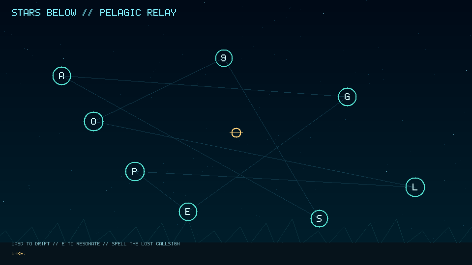
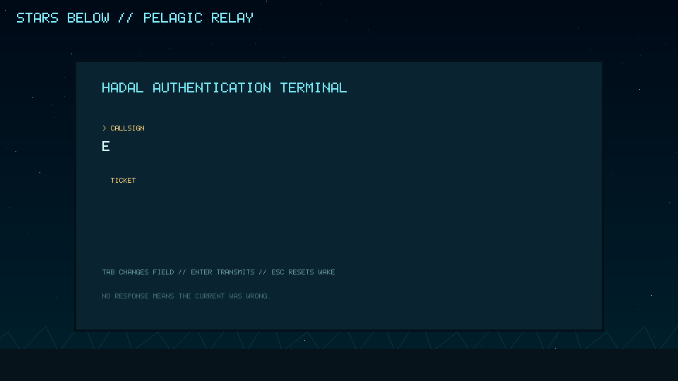

# stars-below

| Field | Value |
| --- | --- |
| CTF | z0d1akCTF 2026 Qualifiers |
| Category | Reverse Engineering |
| Author | afish |
| Points | 209 |
| Solves at time of solving | 28 |
| Flag | `zdk{The_1OAd3r_DREaMS_IN_PAgE_boUNDArIE5}` |

> The drowned observatory still charts a sky.

## Executive Summary

The challenge is a stripped x86-64 ELF with two interfaces:

1. An SDL observatory where eight labeled beacons can be visited in a chosen
   order.
2. A headless verifier accepting `ROUTE`, `CALLSIGN`, and `TICKET`.

The route verifier is small enough to brute force over `8!` permutations. Its
unique solution, `16403752`, indexes the fragment string `AP9GLSEO` and spells
`PELAGOS9`. The ticket is a custom Base32 encoding of a 32-byte payload and a
four-byte BLAKE2s checksum.

Recovering the payload is the main reversing task. The program decrypts two
custom VM programs and expands two round schedules at runtime. VM A performs
24 reversible ARX rounds, followed by a callsign-derived permutation; VM B
performs 19 reversible stack-VM rounds. The verifier compares VM B's final
state with a BLAKE2s-derived target. Starting from that target and applying the
inverse operations in reverse order recovers the complete ticket payload.

The supplied [solver](solve.py) performs this process from end to end and
checks every intermediate layer before producing the ticket.

## Repository Contents

| Path | Purpose | SHA-256 |
| --- | --- | --- |
| [`challenge/rev_stars-below.zip`](challenge/rev_stars-below.zip) | Original handout | `7fab84b9aa51fedadab2efb42b4606aa25011cdaacc0d3f6e625254c7be8d5b9` |
| [`artifacts/vma.bin`](artifacts/vma.bin) | Decrypted VM A bytecode, 1,417 instructions | `69f4678ab8230007ef62532ff13d6a74db614f98b0c4efce455fd9d0451fadb2` |
| [`artifacts/vmb.bin`](artifacts/vmb.bin) | Decrypted VM B bytecode, 1,084 instructions | `672555a51035478f376b01d963e09b70d6b4bb87b551824c9bab1df7fd1477d3` |
| [`artifacts/vma-table.bin`](artifacts/vma-table.bin) | VM A's 24 expanded round records | `18283dc60c7fafb32a95546bd7b0d5f7649a58f48df1c52ac822b7b801fbd4cf` |
| [`artifacts/vmb-table.bin`](artifacts/vmb-table.bin) | VM B's 19 expanded round records | `81eea446295f57a11069908b913ee2b57ff29dda4fe280e672ec8719b26b4c11` |
| [`artifacts/observatory.png`](artifacts/observatory.png) | Initial SDL observatory | `48220b7eebf335ae4ce21d86e53fa2d775405fae2313f7684b8687af76970eca` |
| [`artifacts/authentication-terminal.png`](artifacts/authentication-terminal.png) | Terminal reached after the correct route | `5bc30a145adf3b24c21360565c14636017505714c3658e07aebd5743c67bdf65` |

The extracted ELF has SHA-256
`111b8c3ed811ab5f1d87b0ef131110cd80ef33dba293cade5cdf1adb2dfe7e2c`.

## 1. Initial Triage

The handout contains a short instruction file and one binary:

```console
$ unzip -l rev_stars-below.zip
  Length      Name
---------     ----
    69632     stars_below
      641     PUBLIC.md
```

`stars_below` is a stripped, dynamically linked, non-PIE x86-64 ELF. The
public instructions expose the headless interface:

```text
./stars_below --headless ROUTE CALLSIGN TICKET
```

Useful strings reveal several domain-separated hashes, a custom alphabet, and
the fragment text:

```text
stars-below/name/v1
stars-below/name-guard/v1
stars-below/invariant-mask/v1
stars-below/permutation/v1
stars-below/target/v1
stars-below/ticket/v1
stars-below/vm-a-key/v1
stars-below/vm-b-key/v1
87RJF2ACZLVUMXB3D6GH9WNSYP5QK4ET
AP9GLSEO
```

All hash domains include their terminating NUL byte. Omitting it produces
plausible-looking but incorrect values.

The constructor also rejects instrumentation-related environment variables,
including `LD_BIND_NOW`, `LD_AUDIT`, and `LD_PRELOAD`. The PLT relocations are
deliberately awkward, so static tools can attach misleading import names to
calls. For example, calls labeled as `strstr` by a decompiler behave as
fixed-length memory copies. The call's machine-level argument flow is more
reliable than the imported label in this binary.

## 2. Recovering the Route

At file offset `0x77e0`, the binary stores eight 32-bit constants:

```text
65c39a14 a308269a 990f017c 55f4d8ce
89d5619f e7c6c00f 0ba900e4 6bbe942e
```

The parser requires every digit from 0 through 7 exactly once. For a route
digit `d` at position `i`, the verifier updates a 32-bit state as follows:

```python
state = 0x1799B0E8
for i, d in enumerate(route):
    state ^= constants[d]
    state = rol32(state, d + 5 * i)
    state = (state + i + 0x9E3779B9) & 0xFFFFFFFF
```

The required final state is `0xf06f770b`. There are only `8! = 40,320`
possible routes, so exhaustive search is immediate:

```text
ROUTE = 16403752
```

This result can also be confirmed in the SDL interface. Starting at the
center, visit the beacons in the recovered order and press `E` at each one.



## 3. Recovering the Callsign

The binary stores the fragment text `AP9GLSEO`. Indexing it with the route
gives:

```text
index:     1 6 4 0 3 7 5 2
fragment:  P E L A G O S 9
```

Therefore:

```text
CALLSIGN = PELAGOS9
```

The callsign is independently authenticated by two BLAKE2s hashes:

```python
name_hash = BLAKE2s(
    b"stars-below/name/v1\0"
    + bytes([len(callsign)])
    + callsign
)

guard = BLAKE2s(
    b"stars-below/name-guard/v1\0"
    + binary[0xc6c0:0xc6d0]
    + name_hash
)
```

For `PELAGOS9`, the name hash is:

```text
be69519676875922a1e19a15140e2f8325400003dff4c7bdcf2a9f62db2a77e8
```

The computed guard exactly matches the 32 bytes at file offset `0xc6a0`.
Completing the route opens the authentication terminal:



## 4. Understanding the Ticket

The ticket parser accepts 58 symbols from this alphabet:

```text
87RJF2ACZLVUMXB3D6GH9WNSYP5QK4ET
```

It uses ordinary MSB-first Base32 packing with a custom alphabet and no
padding. The 58 characters decode to 36 bytes:

```text
[ 32-byte payload ][ 4-byte checksum ]
```

The checksum is:

```python
BLAKE2s(
    b"stars-below/ticket/v1\0" + name_hash + payload
)[:4]
```

A valid checksum only reaches the deeper verifier. The all-zero payload, for
example, gives this syntactically valid probe ticket:

```text
888888888888888888888888888888888888888888888888888XUJ6KUZ
```

Using it with the correct route and callsign reaches both VM pipelines before
the final comparison fails.

## 5. Dumping the Runtime VMs

Both VM programs are encrypted in the file and decrypted after the route and
name checks. Running the binary under GDB with the valid probe ticket makes it
possible to capture the bytecode and expanded schedules after decryption.

At `0x404f6c`, VM A is initialized. Its context is at `rbp`, the round table
pointer is stored at `rbp + 0x60`, and the bytecode pointer is at
`rbp + 0x68`:

```gdb
b *0x404f6c
run --headless 16403752 PELAGOS9 888888888888888888888888888888888888888888888888888XUJ6KUZ
dump binary memory vma.bin \
    *(void **)($rbp+0x68) *(void **)($rbp+0x68)+0x2c48
dump binary memory vma-table.bin \
    *(void **)($rbp+0x60) *(void **)($rbp+0x60)+0x3c0
```

At `0x4052c0`, VM B is initialized. Its bytecode is in `r14`, while its table
pointer is at `rbp + 0x68`:

```gdb
b *0x4052c0
continue
dump binary memory vmb.bin $r14 $r14+0x21e0
dump binary memory vmb-table.bin \
    *(void **)($rbp+0x68) *(void **)($rbp+0x68)+0x2f8
```

The committed dumps are the exact output of these commands. The solver checks
their SHA-256 hashes before using them.

## 6. VM A

VM A has 15 encoded opcodes:

| Byte | Operation |
| --- | --- |
| `e9` | Load input word into a register |
| `9a` | Store register into an input word |
| `e0` | Load a round-table word |
| `2c` | Load a round-table byte |
| `5a` | XOR registers |
| `9b` | Add registers |
| `50` | Multiply registers |
| `b5` | Rotate left |
| `7c` | Rotate right |
| `65` | Load immediate |
| `35` | Add immediate |
| `93` | Indirect input load |
| `74` | Unsigned comparison |
| `90` | Conditional relative branch |
| `0b` | Halt |

The 1,417 instructions reduce to 24 rounds of the same construction. Each
round contains two half-rounds and one state-word swap. For one half-round,
let the scheduled state indices be `(a, b, c, d)`, constants be
`(K0, K1, K2)`, and rotations be `(r0, r1, r2)`. All arithmetic is modulo
`2^32`:

```text
A = a + ROL32(b XOR K0, r0)
C = c XOR (A * K2)
D = ROR32(d + C, r1)
B = b XOR ROL32(D + K1, r2)
```

Every operation is invertible. Given `(A, B, C, D)`, reverse the assignments:

```text
b = B XOR ROL32(D + K1, r2)
d = ROL32(D, r1) - C
c = C XOR (A * K2)
a = A - ROL32(b XOR K0, r0)
```

Undoing the round's final swap and processing the half-rounds in reverse order
inverts the complete VM.

## 7. The Callsign Permutation

VM A's output is not passed directly to VM B. The verifier derives a
permutation hash:

```python
p = BLAKE2s(
    b"stars-below/permutation/v1\0"
    + binary[0xc700:0xc710]
    + name_hash
)
perm = sorted(range(8), key=lambda i: (p[i], i))
```

For `PELAGOS9`:

```text
perm = [0, 2, 6, 3, 5, 1, 4, 7]
```

The bridge between the two VMs is:

```text
vm_b_input[i] = ROL32(name_hash_word[i], i + 1)
                XOR vm_a_output[perm[i]]
```

This step is also trivially invertible once the callsign is known.

## 8. VM B

VM B is a stack machine with 11 encoded opcodes:

| Byte | Operation |
| --- | --- |
| `4c` | Push input word |
| `9d` | Push round-table word |
| `e7` | Push round-table byte |
| `b9` | Add |
| `71` | XOR |
| `32` | Multiply |
| `bd` | Rotate left |
| `8a` | Rotate right |
| `a8` | Pop into input word |
| `39` | Swap input words |
| `ed` | Halt |

Its 1,084 instructions form 19 rounds. As with VM A, each round has two
half-rounds and a final state-word swap. One half-round simplifies to:

```text
A = a XOR ROL32(b + K0, r0)
C = c + (A * K2)
D = ROL32(d XOR C, r1)
B = b + ROR32(D XOR K1, r2)
```

The inverse is:

```text
b = B - ROR32(D XOR K1, r2)
d = ROR32(D, r1) XOR C
c = C - (A * K2)
a = A XOR ROL32(b + K0, r0)
```

Again, the final swap is undone first and the two half-rounds are processed in
reverse order.

Each schedule record is 40 bytes. The VM programs encode a reference as
`round << 8 | index`; words live at record offset `8 + 4*index`, and rotation
bytes live at record offset `32 + index`.

## 9. Inverting the Complete Pipeline

The final VM target is derived rather than stored directly:

```python
target = BLAKE2s(
    b"stars-below/target/v1\0"
    + name_hash
    + binary[0xc730:0xc740]
)
```

Its bytes are:

```text
3f3705f91b515e84fd3aed986ad39f8fcfef4e10cf57ae0ea27993c606d383d4
```

The recovery path is now deterministic:

1. Interpret the target as eight little-endian words.
2. Invert VM B's 19 rounds.
3. Undo the callsign-derived permutation and word rotations.
4. Invert VM A's 24 rounds.

Useful intermediate states, shown as little-endian 32-bit words, are:

```text
VM B target:
f905373f 845e511b 98ed3afd 8f9fd36a
104eefcf 0eae57cf c69379a2 d483d306

VM B input after inversion:
37cc935a d3fa9d68 a6a6b331 ddbadc84
974f2a49 d4c07fa2 4bb59cce 9c08e10d

VM A output after undoing the permutation:
1b6e4027 a53d484d 5a9c80b0 ef4a3dcc
0420fb7f f7472ee9 0a71be39 eb223ae5
```

Inverting VM A produces the 32-byte payload:

```text
686a5e569650dcc9eecc2f5b1ad4cc0908e464cfea3c1f4f01a2c901dce88e6e
```

## 10. Independent Invariant Check

The verifier also checks eight modular equations. Let the payload be eight
little-endian words `w[0..7]`, `M` be the matrix at file offset `0x76e0`, and
the rotations be:

```text
[28, 12, 6, 22, 26, 27, 11, 5]
```

For row `i`, the checked value is:

```text
sum(M[i][j] * w[j] for j in 0..7)
+ ROL32(w[(i + 3) & 7] XOR w[(i + 1) & 7], rotations[i])
```

The expected value is the corresponding word at file offset `0x76c0` XOR a
word from:

```python
BLAKE2s(
    b"stars-below/invariant-mask/v1\0"
    + binary[0xc6d0:0xc6e0]
    + name_hash
)
```

All eight equations match the recovered payload. This is a useful independent
check that the VM inversion and byte ordering are correct.

## 11. Building and Verifying the Ticket

The first four checksum bytes are:

```text
a032fc14
```

Appending them to the payload and encoding all 36 bytes with the custom
alphabet yields:

```text
X7W2KW9NVJBMHQNM24X6WWAM7FFBZPA34ZE7EHY79UFDJSCZ6PSV8MSKRD
```

Run the portable offline solver from this directory:

```console
$ python3 solve.py
route    = 16403752
callsign = PELAGOS9
namehash = be69519676875922a1e19a15140e2f8325400003dff4c7bdcf2a9f62db2a77e8
payload  = 686a5e569650dcc9eecc2f5b1ad4cc0908e464cfea3c1f4f01a2c901dce88e6e
ticket   = X7W2KW9NVJBMHQNM24X6WWAM7FFBZPA34ZE7EHY79UFDJSCZ6PSV8MSKRD
checks   = route, name guard, VM A, VM B, and invariants passed
```

On x86-64 Linux with SDL2 available, `--execute` extracts and runs the original
ELF in headless mode:

```console
$ python3 solve.py --execute
...
flag     = zdk{The_1OAd3r_DREaMS_IN_PAgE_boUNDArIE5}
```

The equivalent direct invocation is:

```console
$ ./stars_below --headless \
    16403752 \
    PELAGOS9 \
    X7W2KW9NVJBMHQNM24X6WWAM7FFBZPA34ZE7EHY79UFDJSCZ6PSV8MSKRD
zdk{The_1OAd3r_DREaMS_IN_PAgE_boUNDArIE5}
```

## Flag

```text
zdk{The_1OAd3r_DREaMS_IN_PAgE_boUNDArIE5}
```
